Lorenzo e Sarah, due miei cari amici, sono da poco andati ad abitare assieme in una bella casa di 3 piani che è in gran parte già arredata, hanno in mente di cambiare gradualmente l’arredamento che non li rispecchia pienamente.

Qualche giorno fa mi hanno invitato a vedere l’appartamento che mi ha davvero stupito in quanto a dimensioni, è un appartamento pieno di aree differenti tra loro che si possono destinare in tanti modi diversi.

Entrambi sono interessati allo stile DIY, ho pensato quindi di dargli una spintarella sul genere dell’arredamento di casa realizzando un tavolino per la sala, una delle prime aree che vogliono cambiare.

Da qualche settimana avevo dei pneumatici in magazzino che avevo in mente di recuperare per fare un piccolo tavolino da mettere vicino al divano di casa, ho deciso di utilizzarli per loro.

Le ruote me le ha procurate un altro mio caro amico, Gianni, sapendo che ero interessato a realizzare qualcosa di simile è stato così gentile da ricordarsene e si è preso pure lo sbattimento di andarle a recuperare per me.

#### Pulizia dei pneumatici

Più che in altri casi, i pneumatici devono essere puliti alla perfezione perché a contatto con l’asfalto e le polveri sottili degli scarichi di tutte le automobili.

Parte del residuo lasciato sulle dita è sicuramente dovuto alla presenza nelle mescole del nerofumo (polvere di carbonio), motivo per cui i pneumatici sono neri.

Quando li ho toccati con le dita ho sospettato che non si trattasse solo di residui di pneumatico, ma anche di polveri di gas di scarico depositate sull’asfalto, visto che deve essere un regalo, è il caso di fare un bel lavoro al fine di non consegnare un oggetto potenzialmente tossico!

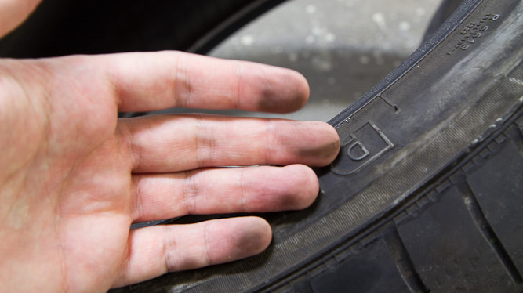

#### Lavaggio dei pneumatici

Per cominciare, ho optato per una pulizia specifica per rimuovere il grosso senza utilizzare del sapone. Con una spazzola ho dato una passata decisa a tutta la superficie del pneumatico, sia internamente che esternamente, paradossalmente il grosso dello sporco era proprio all’interno.

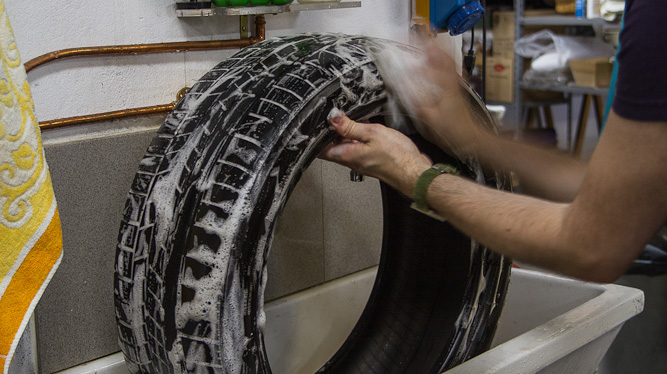

Successivamente ho dato un’ altra passata con un sapone qualsiasi, nel mio caso ho utilizzato un sapone per le mani.

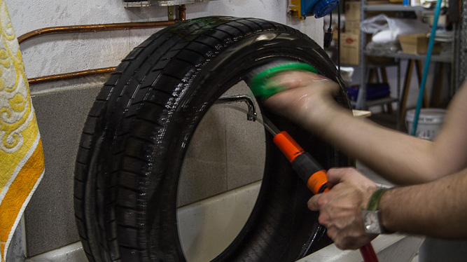

Per evitare di appoggiare i pneumatici al pavimento sporco da bagnati, li ho appesi con dei ganci che mio papà ha montato.

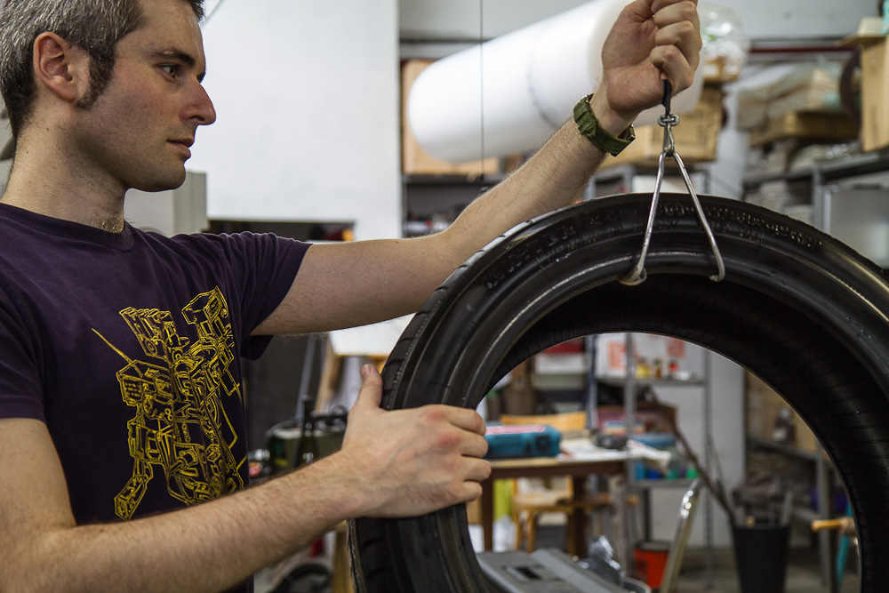

fortunatamente il soffitto del magazzino dove lavoro ha molte tubazioni che posso sfruttare per appenderci oggetti non troppo pensanti.

#### Un tocco in più

Una volta asciutti, i pneumatici hanno nuova vita, ora è possibile vedere che sono usati solo da vicino, il suo possessore precedente ha dimenticato di girare le ruote che ora hanno un lato estremamente consumato ed uno praticamente nuovo, il lato che metterò più a vista.

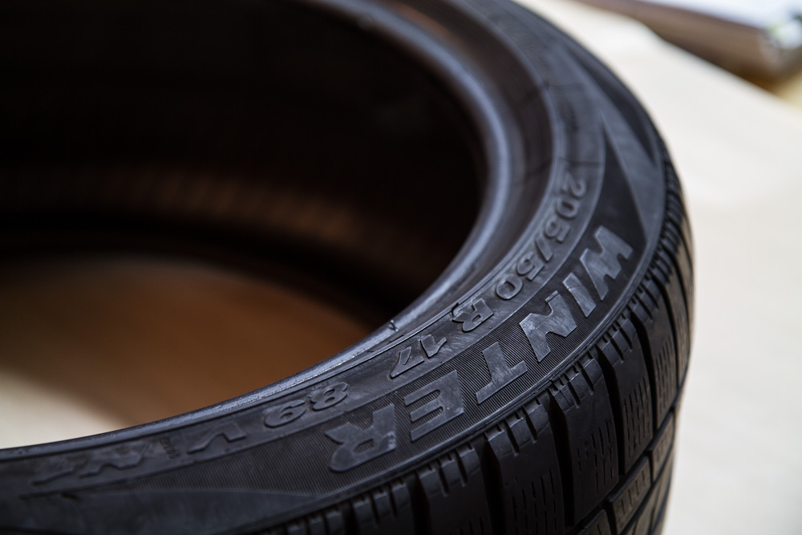

Ho pensato di dare un tocco aggiuntivo ai pneumatici colorando le scritte di bianco, come i pneumatici sportivi. Lorenzo ama la grafica e i loghi in generale, sono sicuro che questa modifica all’originale sarà gradita.

#### Decorazione del lettering

Questa è la parte più complessa del lavoro, rendere le scritte bianche è un problema perché non so come si comportano i colori sul pneumatico, non vorrei consegnare qualcosa che perde il colore al solo contatto. Ho preferito stare sul sicuro dando una mano di aggrappante di gesso, per poi darne un altra di colore acrilico bianco titanio.

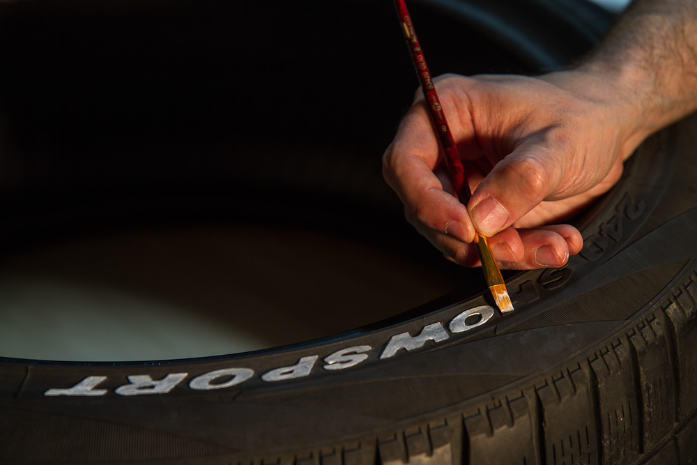

#### Precauzioni di applicazione

È fondamentale usare un pennello piatto a pelo morbido e pochissimo prodotto sia di colore che di aggrappante, il dislivello tra il lettering e il fondo di gomma è meno di 1mm, sbagliare è quasi inevitabile, fortunatamente mi è successo solo in qualche area!

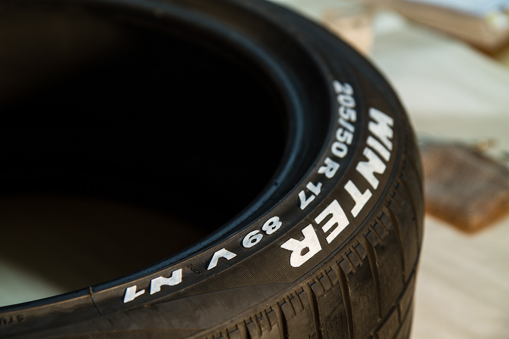

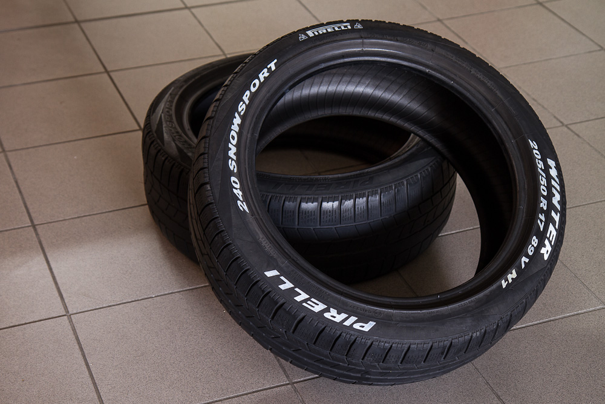

#### Funzionalità

Quando riciclo un oggetto non penso solo ad estrarlo dal suo contesto al fine di riutilizzarlo, il mio desiderio è quello di elevarlo a qualcosa bello e funzionale allo stesso tempo.

Trattandosi di un tavolino da sala e di un paio di pneumatici ho deciso di montare un disco di acciaio spazzolato in superficie che fungerà da cerchione, da coperchio e che permette al suo utilizzatore di poterci appoggiare i piedi senza la paura di ammaccarlo o graffiarlo.

Ho deciso di mettere un altro disco tra i due pneumatici in modo che si possano depositare oggetti al suo interno alzando quello superiore che fungerà anche da coperchio.

Il comfort prima di tutto!

#### Perforazione precisa

Ora sopraggiunge la questione di come montare i pneumatici tra loro, alla fine ho deciso di imbullonarli a tre bulloni, che dovrebbero tranquillamente bastare al mio obiettivo.

Il problema della perforazione sta nel fatto che il trapano non può perforare verticalmente entrambi i pneumatici impilati, ho pensato quindi di segnare i fori con una pallina di colore acrilico di un solo pneumatico per andare poi a sovrapporli, così facendo posso perforare i pneumatici uno dopo l’altro senza sbagliare la posizione dei buchi.

#### Perforazione precisa

Risolto il problema tecnico della perforazione, posso continuare il lavoro senza problemi. Questa azione produrrà un forte attrito sul pneumatico che emanerà fumo, puzza di gomma bruciata e molti residui di gomma che saranno poi da pulire, assicuratevi di non fare il lavoro nel posto sbagliato!

#### Smalto per lucidatura

Eccomi arrivato alle rifiniture, dopo essermi consultato un po’ in giro, ho acquistato uno smalto trasparente opaco spray da applicare ai pneumatici per renderli brillanti senza esagerare con l’effetto lucido. In questo caso ho utilizzato un prodotto chiamato Drip Smalto Acrilico Spray trasparente opaco, che si è rivelato adatto al mio scopo.

L’effetto ottenuto si è rivelato nettamente migliore di quello che mi aspettavo, lo smalto ha reso la superficie più liscia e asciutta, togliendo l’effetto gommoso aderente, oltre ad aver reso gli pneumatici più brillanti pur mantenendoli opachi.

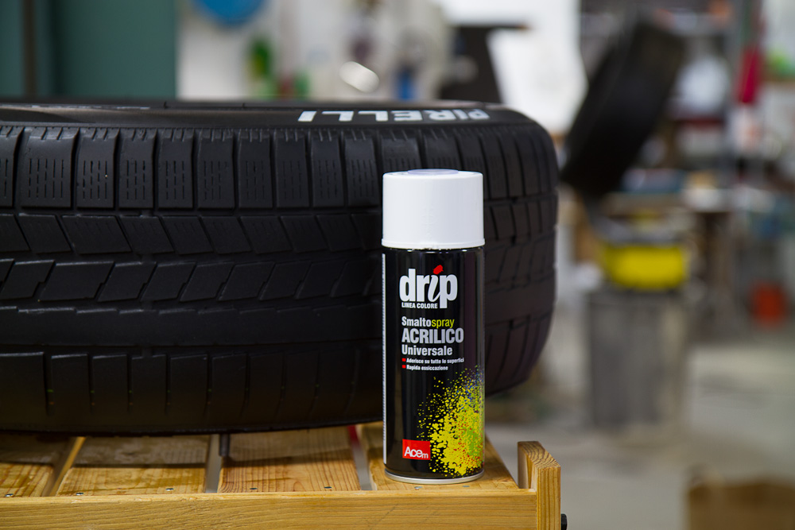

#### Preparazione dei piani per il tavolino

Come scrivevo prima, per me un oggetto ha un senso quando è funzionale al proprio utilizzo, pensando di voler realizzare un tavolino da mettere davanti ad un divano, questo deve poter sopportare graffi di chiavi, monete, telecomandi o joypad, eppure essere accogliente al punto che uno possa appoggiarci i piedi sopra senza avere paura di usurare, graffiare o sporcarsi.

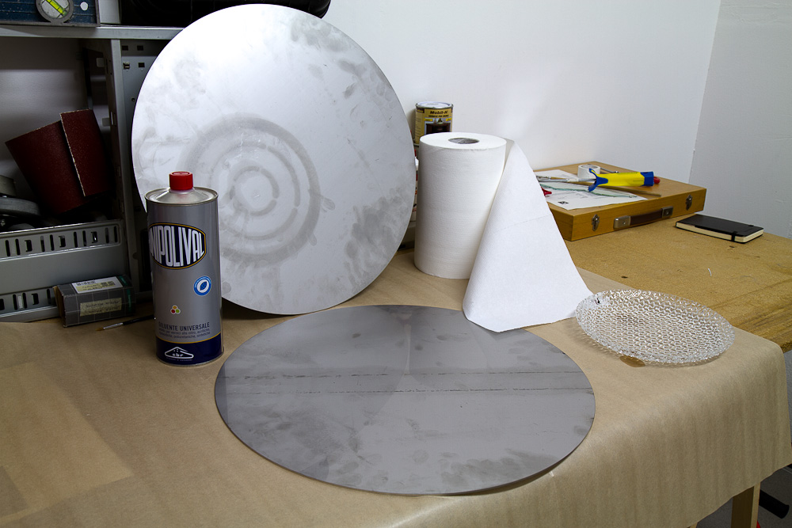

Per questo ho scelto di montare due piani di acciaio, una volta che avrò spazzolato la superficie saranno a prova di graffio e abbastanza resistenti alle ditate.

#### Sgrassatura iniziale

Durante le fasi di taglio della lamina di acciaio, questa viene trasportata utilizzando delle ventose che aderiscono alla superficie grazie ad un olio con il quale vengono unte.

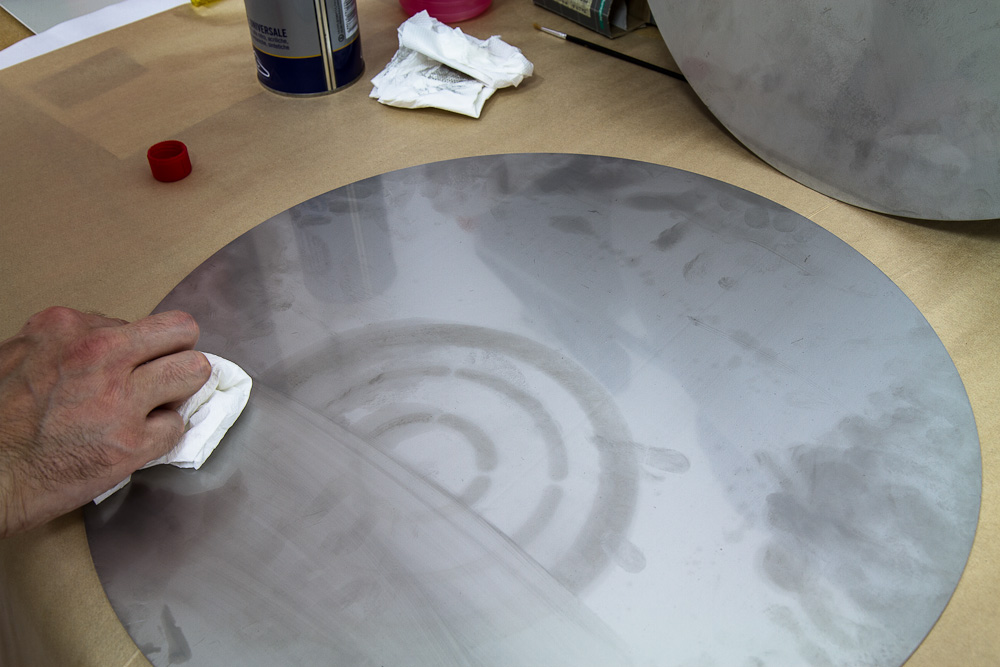

Una volta consegnati, questi piatti di acciaio vanno puliti con del solvente per portare via tutto l’olio prima di procedere, altrimenti questo si andrebbe ad insinuare nei micro graffi della spazzolatura e in generale, ungerebbero.

#### Spazzolatura

Spazzolare una superficie di acciaio significa graffiarla con moto circolare tramite una paglietta abrasiva che renderà la superficie opaca e anti-graffio, perché più di così non si graffia!

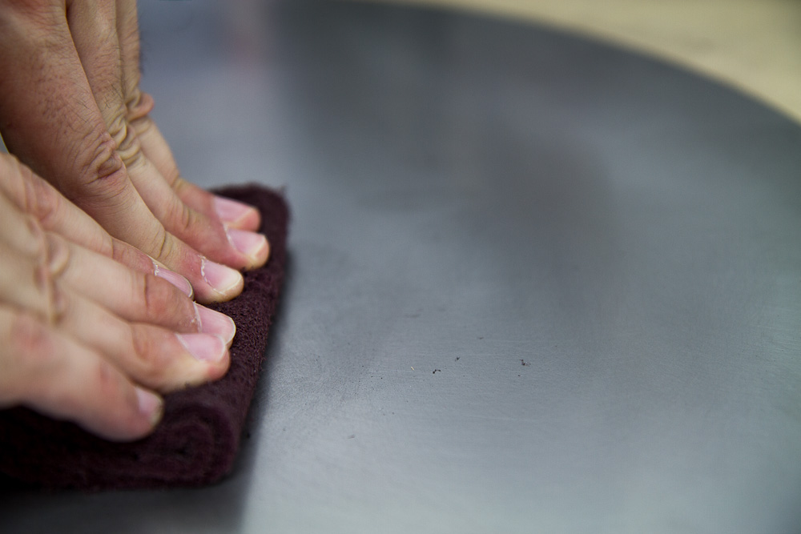

Questa azione non è neanche così faticosa, basta fare un paio di giri con due mani e si raggiunge il risultato desiderato.

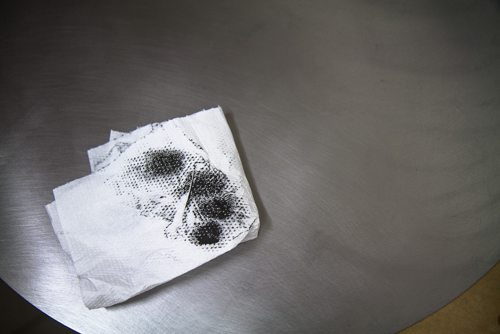

#### Pulizia delle superficie

Il problema nasce dai residui di acciaio, si presentano come una polvere finissima, difficile da rimuovere e capace di macchiare al tatto.
Per pulire la superficie ho dovuto dare 5-6 mani di diluente prima delle quali la superficie macchiava senza problemi sia le dita che la carta. È stato più faticoso pulire col solvente che spazzolare la superficie!

#### Montaggio del tavolino

Sono arrivato al montaggio dei piatti di acciaio, una volta avvitato tutto, il lavoro è praticamente finito e il piatto centrale sarà bloccato tra i due pneumatici agganciati tra loro dai tre bulloni.

Ho voluto realizzare un tavolino completamente smontabile per permettere ai miei amici di cambiare i due piatti in caso di necessità.

#### Presa per apertura coperchio

Per far si che il tavolino lo si possa utilizzare anche come contenitore è necessaria una presa che permetta al suo utilizzatore di tirare su il coperchio.

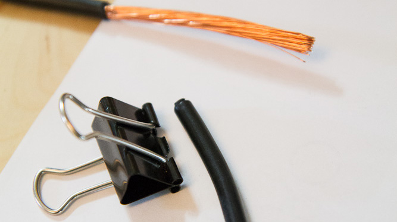

Per farlo ho utilizzato una semplice pinza fermacarte assieme ad un pezzo di guaina proveniente da un filo elettrico che evita alla pinza di scivolare sull’acciaio.

#### Montaggio ultimato

Tadaaan! Ecco il tavolino ultimato, è venuto un bel lavoro e spero che a Spek e Sanah (Lorenzo e Sarah) piacerà!

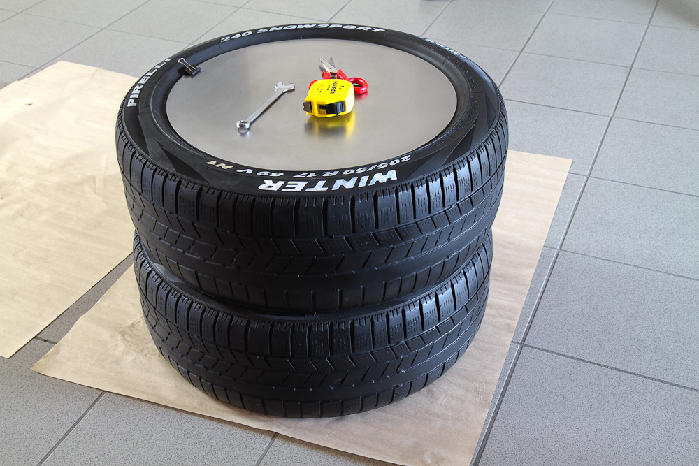

Prima di consegnarlo ho deciso di fare un test da me in sala per la prova del fuoco sul parquet, la gomma non dovrebbe macchiare ma non si sa mai, il pavimento è trattato con dei prodotti naturali, questo lo rende meno chimico ma è anche più esposto a questo genere di rischi.

#### Prove generali

La prova parquet è passata senza problemi e il contenitore funziona perfettamente, mi sento pronto a consegnare il regalo ai miei amici!

Quale sarà il verdetto finale??
