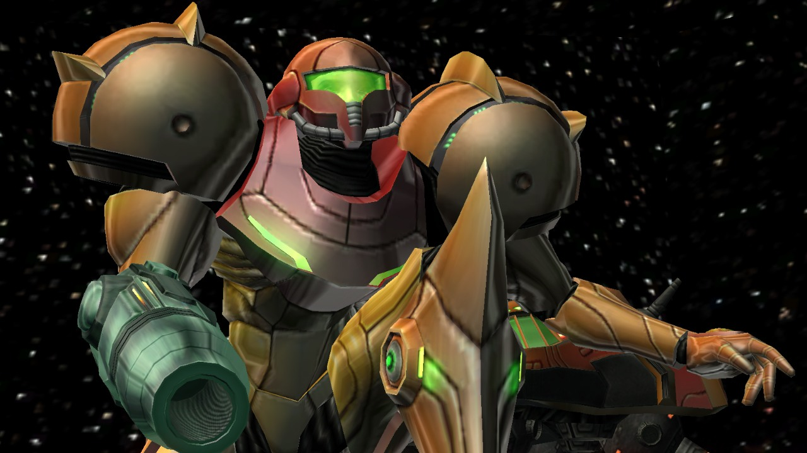
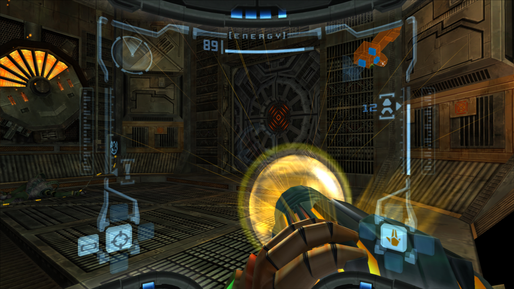

Quando nel lontano 1999 giocai per la prima volta ad **Unreal Torunament**, pensai subito: Giocare con il mouse e la tastiera ad un FPS è un gradino sopra al controller. Punto.

Ero così fermo su questo punto di vista che ho evitato per anni di giocare ad FPS su console, perché per me equivaleva a pilotare un'automobile con la tastiera, in pratica usare un controller mi avrebbe rovinato l'esperienza.

Un bel giorno, mentre facevo spesa al supermercato, notai su uno scaffale il **Bundle Nintendo Gamecube + Metroid Prime** a 50€, era estate e visto che non avevo nulla da fare, decisi di comprarlo per giocarci nei tempi morti, anche se non avevo grandi aspettative.

Penso che quel giorno invece di comprare il Gamecube, forse avrei dovuto giocare la Lotteria, se avessi avuto la stessa fortuna ora sarei ricco.

### Atmosfera

Il Gamecube era una console vecchia quando l'ho acquistata, tra l'altro in quel periodo giocavo su PC, quindi ero abituato bene per quanto riguarda standard grafici, per cui pensavo che ci avrei giochicchiato un po' e che molto probabilmente avrei lasciato la console li a prendere polvere.

Appena iniziata la partita, ho subito capito che si trattava di un titolo tutt'altro che da poco, era eccezzionale fin dai primi istanti, i limiti della console passavano subito in secondo piano grazie alla grande atmosfera, subito immersiva e coinvolgente.

Di per se gli effetti visivi sono pochi, ma sempre calibrati al millimetro, ogni luce, texture e scorcio sono funzionali al nascondere le poche risorse della console e ad esaltare il racconto, un lavoro degno di un team AAA.

### Esplorazione

La grande scommessa ha fatto [Retro Studios][retro] (team che ta dietro questo capolavoro) stava nel portare in 3D un gioco le cui meccaniche sono di natura strettamente legate al 2D, pochi avrebbero scommesso che sarebbero riusciti a dare la stessa profondità di esplorazione.

Il punto è che non solo sono arrivati ad eguagliare la profondità di esplorazione dei titoli 2D, sono riusciti ad esaltarla e superarla, grazie anche ad un level design magistrale, si ha costantemente la sensazione di avere lasciato qualcosa indietro, come se non avessimo guardato abbastanza in una zona, perché c'era un dettaglio sospetto in una parete.

### Meccaniche

Samus

### Combattimenti

Samus

[retro]: https://www.retrostudios.com/
