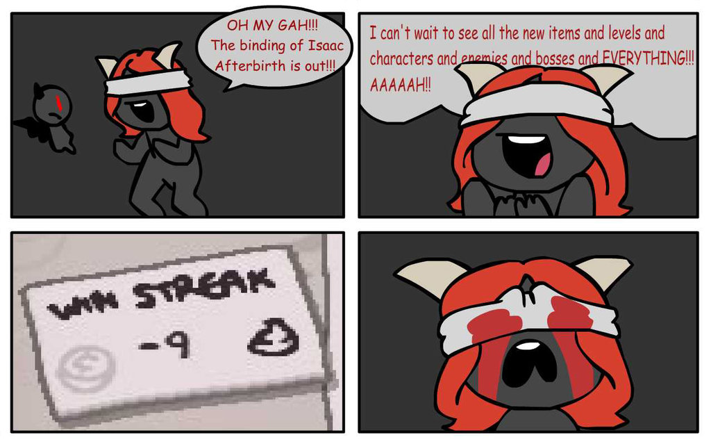

Ciaone di articolo

---

### Verdetto

Isaac da il massimo proprio nei punti cruciali dove un titolo indie come questo dovrebbe fare, per quanto sia semplice, il level design e la meccanica [Roguelike][roguelike] molto simile al bellissimo [Risk of Rain][ror] lo rendono incredibilimente longevo e divertente, soprattutto per la piega che può prendere una partita e il modo improvviso in cui tutto può cambiare, con un po' di fortuna o con una botta di sfiga.

[roguelike]: https://it.wikipedia.org/wiki/Roguelike
[ror]: https://riskofraingame.com/
