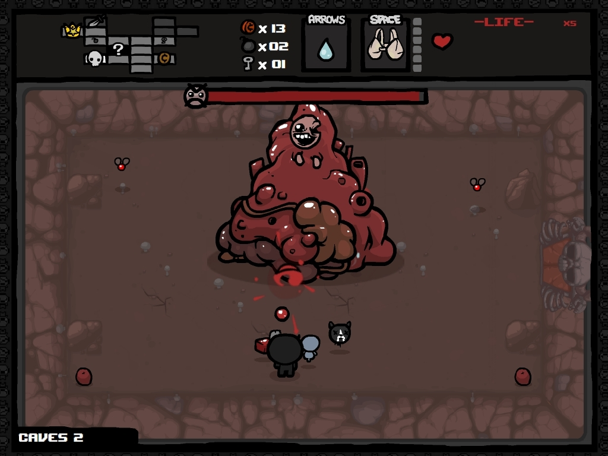
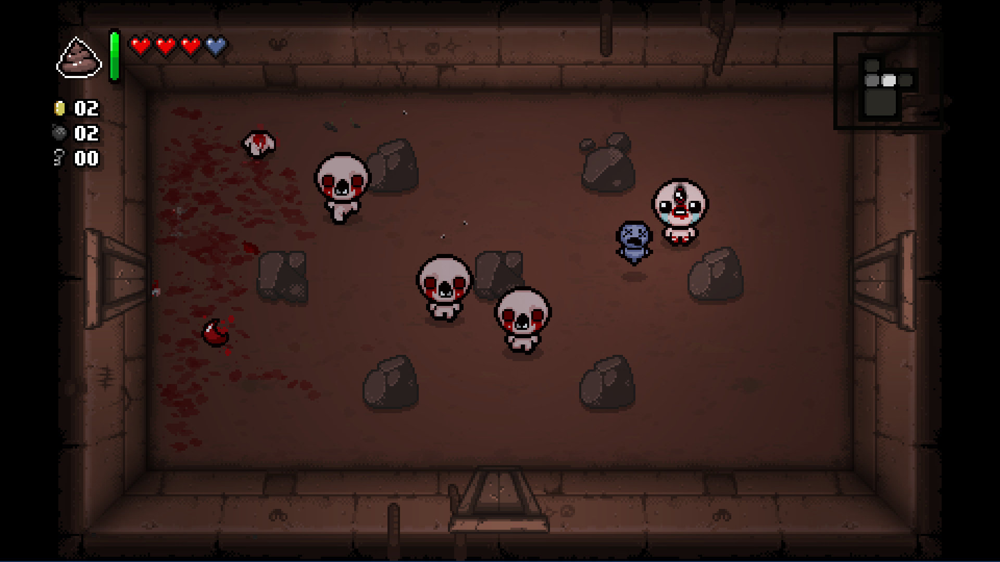

La prima volta che ho giocato ad Isaac è stato su Steam, avevo acquistato il gioco con poche aspettative, ma mi intrigava la visuale top down stile il primo **The Legend of Zelda** per <abbr title="Nintendo Enterntainment System">NES</abbr>.

La prima release del gioco era stata sviluppata interamente in *Shockwave Flash*, un web player ormai defunto che supportava *ActionScript* un linguaggio facile da imparare ma comunque con delle limitazioni. Quella versione era svilupata con disegni vettoriali, abbastanza semplici non troppo brillanti ma ben animati.

Successivamente, ne uscì una versione completamente riprogrammata, lo scopo era l'abbandono di flash per poter avere un engine più performante e con meno bug, ma soprattutto portabile su più piattaforme.

### Meccaniche

Ho trovato il gioco immediatamente severo, crudo e senza nessun tipo di aiuto verso il giocatore, eppure semplice e chiaro, privo di insicurezze per quanto riguarda le meccaniche e il modo in cui il personaggio interagisce con i pericolosi labirinti, dove la morte è sempre in agguato, pronta a colpire da un momento all'altro.

La meraviglia di questo gioco sta nel loot system concatenabile, dove ogni oggetto che viene trovato si addiziona alle abilità di Isaac. Queste abilità sono tutt'altro che banali e ripetitive, nel gioco ci sono una marea di oggetti, così tanti da non permetere al giocatore di ricordarsi a cosa servano e dando alla partita sempre delle pieghe differenti in quanto difficilmente ci ritroveremo con le stesse abilità ogni volta.

### Gameplay

In totale, contando gli oggetti tra le pagine di [Gamepedia][gamepedia], vanta di **125 ciondoli**, **120 oggetti consumabili** e **410 oggetti passivi**, dove ogni oggetto ha delle ripercussioni sul gameplay davvero molto eterogenee e danno alla partita una variabilità che ti fa vivere in un continuo stato di dubbio e tensione.

La quantità di oggetti è così vasta che è impossibile ricordarsi gli effetti di ogni singolo item e se ciò che stiamo per raccogliere valorizza item precedenti in quanto a prestazioni, avere una guida sotto al naso non aiuta più di tanto perché bisogna leggere tutta la lista infinita per riconoscere visivamente quale stiamo per raccogliere. Probabilmente questa struttura non è così a caso, l'ideatore voleva che il giocatore vivesse l'avventura in pieno stile rougelike e più di così si muore, infatti si muore continuamente.

Prendere l'oggetto sbagliato potrebbe rovinare una partita perfetta, anche quando quest'ultimo porta una serie dei benefici. Qui si mostra il genio di **Edmund McMillen**, vettore di un bilanciamento che rendere il gioco imprevedibile e allo stesso tempo coerente col suo immaginario.

### Atmosfera

Tutto l'immaginario di **Edmund McMillen** (principale autore del gioco) è angosciante, perverso e coerente con le paure che l'immaginario di un bambino di 5 anni può avere, quindi cacca, pipì, sangue, puzza, disgusto per il cibo, animali disgustosi, interiora, marciume, sporco, etc. Ci ho visto una relazione all'immaginario horror degli anni '80-'90, mi ricorda parecchio gli [Sgorbions][sgorbions], a sua volta parodia delle bambole [Cabbage Patch Kids][cabbage].

### Storia

Oltre a questa amosfera horror del mondo di un infante, la storia del goco è ispirata alla vicenda biblica di [Isacco][isacco]. La storia narra del bambino Isaac e sua madre, intenta ad ucciderlo per il volere divino, in quanto corrotto dal male, la vicenda è in realtà il frutto dei disegni di Isaac assieme e parti della sua vita reale, infatti durante l'avventura troverà item collegati alla sua vita, come una collana della madre, chiavi di papà, o cose legate all'universo horror che immagina.

### Combattimenti

Ho trovato il gioco subito severo e con un AI basilare ma terribilmente malefica, sempre pronto a prenderti di sorpresa, nonostante tu ti stia aspettando la sorpresa.

### Pixel art

La pixel grafica è di per se curata in maniera minuziosa, il gioco vanta di un bestiario esageratamente vasto, **183 mostri** e **196 boss** differenti, dietro questo gioco c'è un lavoro immane, splendidamente disegnato.

Ecco come si presentava il gioco nella versione *Shockwave Flash*:

Ecco la versione ridisegnata in pixel grafica:

Un punto negativo sulla grafica è lo scaling degli asset grafici, necessario a tutta una serie di dinamiche di gioco legate alla dimesione variabile di proiettili e personaggi, che così possono essere più o meno facili da colpire. Di fatto è importante per il gameplay, peccato che faccia sembrare il gioco meno curato di quello che in realtà è.

Si può notare anche un po' di sbavatura nello scaling generale che non disturba più di tanto perché molto leggero e non sempre presente, però non è sicuramente lodevole.

### Level design

---

### Verdetto

Isaac da il massimo proprio nei punti cruciali dove un titolo indie come questo dovrebbe fare, per quanto sia semplice, il level design e la meccanica [Roguelike][roguelike] molto simile al bellissimo [Risk of Rain][ror] lo rendono incredibilimente longevo e divertente, soprattutto per la piega che può prendere una partita e il modo improvviso in cui tutto può cambiare, con un po' di fortuna o con una botta di sfiga.

[cabbage]: http://www.cabbagepatchkids.com/
[gamepedia]: https://bindingofisaacrebirth.gamepedia.com/
[isacco]: https://it.wikipedia.org/wiki/Isacco
[roguelike]: https://it.wikipedia.org/wiki/Roguelike
[ror]: https://riskofraingame.com/
[sgorbions]: https://it.wikipedia.org/wiki/Sgorbions
