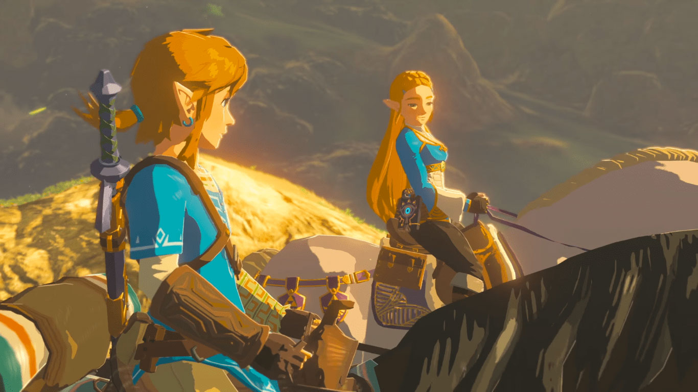
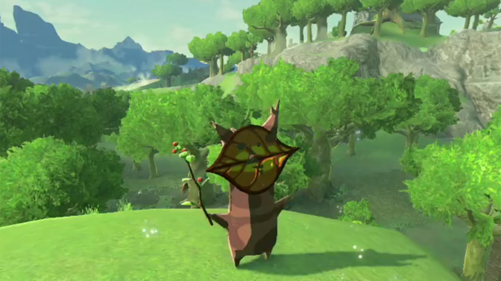

Come la stragrande maggioranza di chi ha acquistato un [Nintendo Switch][switch] i primi giorni dal lancio, anche io ho scelto come primo titolo [Breath of the Wild][breath]. Totalmente rapito dagli screenshot che giravano online, sono stato colpito dalla sensazione di un mondo vivo, emozionale e in qualche modo anche malinconico.

### Atmosfera

Fin dai primi istanti si ha la sensazione di essere all'interno di un lungometraggio di Studio Ghibli, quello che arriva subito sono le emozioni di fronte ad un luogo incontaminato e selvaggio, apparentemente tranquillo e sicuramente molto vasto.

Oltre a riprendere visivamente opere come Princess Mononoke, il motore proprietario di Nintendo rappresenta le ambientazioni con l'effetto [En Plain Air][youtube-epa], come detto all'E3 da [Artsy Omni][artsy].

Si avverte il senso di un mondo misterioso e sacro, di una semplicità visiva che nasconde una grande complessità strutturale, grazie anche al motore fisico e a come il team è riuscito ad integrarlo con le meccaniche di gioco.

### Motore fisico

Probabilmente tra i più brillanti che si possono trovare in un video gioco, pochi titoli sanno rendere così intuitivo un motore fisico, come il materiale degli oggetti che reagisce ai reagenti ai quali li sottoponiamo, oltre che al peso, alle leve e ai vari modi con cui possiamo giocare col mondo, è possibile bruciare il legno, spegnere il fuoco con l'acqua, condurre elettricità tramite materiali metallici, vedere incendi seguire il verso del vento, e non basta, ci sono decine e decine di modi con i quali si può interagire con il motore fisico, permettendo di donare un sacco di sorprese divertenti, appaganti e incredibilmente intuitive.

### Esplorazione

Muoversi per Hyrule è molto piacevole, la zona nella quale è possibile muoversi è molto vasta e sempre piena di scorci suggestivi, luoghi da visitare, segreti da scoprire, personaggi con i quali interagire o avversari da fronteggiare.

I biomi delle aree di gioco sono suddivisi dai classici fattori come geologia, fauna e flora, tuttavia viene introdotto anche un aspetto legato alla temperatura atmosferica che rende l'esperienza più survival, impedendo così al giocatore di addentrarsi in alcune aree a meno che prima non si sia procurato l'equipaggiamento adatto.

Mi ha colpito la possibilità di scalare la stragrande maggioranza di superfici, infatti è possibile arrivare praticamente ovunque, l'importante è avere abbastanza forza residua, altrimenti converrà tornare una volta acquisite le risorse sufficienti a superare l'ostacolo. In questo modo il mondo risulta colmo di posti che possiamo raggiungere ma che siamo costretti a lasciare li per poter tornare successivamente, riusciremo a ricordarcene? Probabilmente no, so che ho lasciato indietro molte aree e non sempre ne ricordo la posizione esatta.

Durante il viaggio, avremo la possibilità di collezionare nel bestiario tutti gli avversari che incontriamo, basterà fotografarli, magari senza essere visti per poter salvare le informazioni contestuali, col tempo inizierete ad avere un bestiario pieno di foto fatte fa voi, cosa che lo renderà personale e in qualche modo, prezioso per questo motivo. Per me questa è una trovata semplicemente geniale.

### Segreti

Ad oggi, dubito che esista un gioco che possa offrire un così vasto numero di segreti. Sono semplicemente ovunque, come i 900 Korok, che potrebbero essere sotto ad un sasso, dietro ad una statua per le offerte, potrebbero celarsi in un punto specifico dell'acqua oppure sotto un mucchio di foglie.

Non sono solo questi i segreti di Breath of the Wild, ce ne sono di ogni genere, dai sacrari, i draghi erranti, i set di armature, le armi, i cavalli, le oasi delle fate, in pratica ogni cosa è fatta per essere scoperta e mai realmente necessaria per ultimare il gioco, la quest principale di per se non è particolarmente lunga, è il perdersi in questo meraviglioso mondo, così colmo di dettagli che ci fa vivere la vera essenza di come è stato pensato.

### Combattimenti

Anche un album come [Dark Side of the Moon][pink] ha per chi l'ascolta una parte più interessante di un'altra, nonostante sia considerato un capolavoro, non può esistere un album dove amiamo alla stessa maniera ogni canzone. Così è anche per **Breath of the Wild**, l'aspetto che forse mi ha colpito meno sono i combattimenti.

Non si può certo dire che sono tirati via, i combattimenti sono impegnativi e forse un po' legnosi, ma comunque intuitivi come il resto delle meccaniche di gioco.

Di norma abbattere un nemico come un gruppo di Boblin non è particolarmente impegnativo, tuttavia sarà raro svolgere un combattimento pulito, la vastità del gioco porta ad affrontarli in modo sbrigativo, proprio per la pazienza che richiedono se si vuole "giocare bene".

### Bilanciamento

Ci sono scelte nel Bilanciamento che faccio fatica a considerarli errori, tuttavia sono scelte che mettono automaticamente questo titolo nella fascia "non per tutti".

La durabilità delle armi ad esempio, può risultare frustrante se siete uno di quei giocatori che si affezionano ad una spada o un arco, preparatevi perché li cambierete pressapoco in continuazione.
Questo aspetto è probabilmente voluto per rendere l'esperienza più survival e meno <abbr title="Role playing game">RPG</abbr> riuscendoci, si tende infatti ad adattarsi a quello che passa il convento, cioè gli avversari abbattuti.

Anche alcuni avversari sembrano non essere bilanciati, probabilmente sempre per l'impronta survival decisa. I Lynel ad esempio, non sono solo temibili avversari, sono probabilmente i più difficili da battere nel gioco, anche più dei boss della quest principale. Con queste creature, la maggior parte delle volte finiremo per venire uccisi, richiederà un sacco di pratica imparare a batterli.

---

### Verdetto

Breath of the Wild è un complesso capolavoro, che sa regalare ore e ore di avventure, in un mondo malinconico e pieno, pieno, pieno di cose da fare, meccaniche da scoprire, terre da visitare, villaggi in cui stabilirsi, avversari da affrontare, e potrei andare oltre nel descrivere l'innumerevole mole di cose da fare in questa opera curata in ogni suo aspetto, con amore ed attenzione. Un must per i possessori di [Switch][switch].

[artsy]: https://twitter.com/artsyomni
[breath]: http://www.nintendo.it/Giochi/Nintendo-Switch/The-Legend-of-Zelda-Breath-of-the-Wild-1173609.html
[pink]: https://it.wikipedia.org/wiki/The_Dark_Side_of_the_Moon
[switch]: https://www.nintendo.com/switch/
[youtube-epa]: https://youtu.be/sf4gtlM0mYs?t=1m51s
